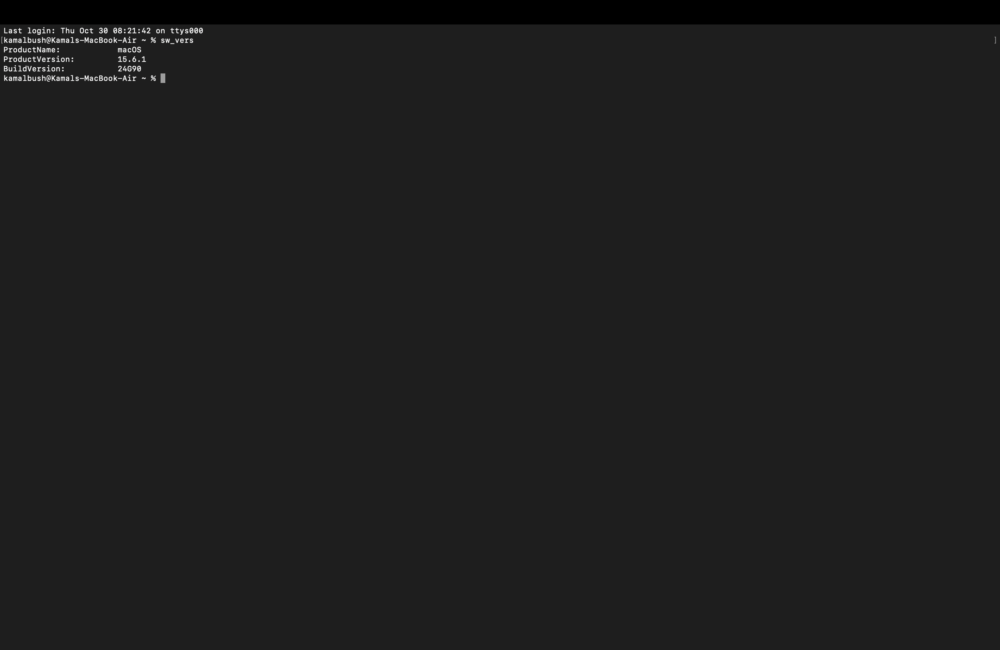
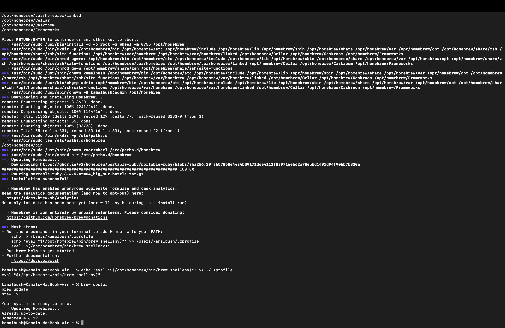
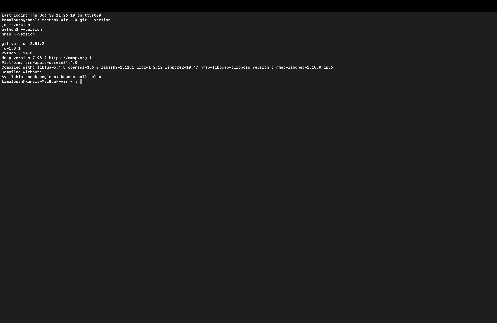

# 🍏 macOS IT Support & Security Labs – CBP OIT Prep

**Author:** [Kamal Bush](https://github.com/kbush2)  
**Focus Area:** macOS Administration · Endpoint Hardening · Automation · Incident Response  
**Goal:** Hands-on, evidence-based portfolio aligned with **DHS CBP OIT IT Support / Cyber Analyst** competencies.

---

## 🧩 Overview
Practical labs covering:
- macOS system auditing and inventory  
- Secure baseline configuration (FileVault, Firewall, Gatekeeper)  
- Logging & telemetry (`log`, `auditd`, `osquery`)  
- Built-in endpoint protections (SIP, XProtect)  
- zsh automation (JSON + HTML output)  
- Configuration Profiles (MDM simulation)  
- Local incident response triage  

Each lab folder contains a `README.md`, `artifacts/`, and `images/` directory with step-by-step instructions, screenshots, and results.

---

## 🧱 Lab Index

| # | Lab | Focus Area | Evidence |
|:-:|:----|:------------|:---------|
| 1 | System Audit & Inventory | Hardware/software audit | `system_profile.json`, `screenshots` |
| 2 | Homebrew & CLI Toolkit | Admin tool setup | `brew_list.txt`, `screenshots` |
| 3 | User Mgmt & Secure Baseline | FileVault, Firewall | `baseline.md` |
| 4 | Logging & Telemetry | Unified logs + auditd | `audit_sample.txt` |
| 5 | Built-in Endpoint Security | XProtect · SIP · Quarantine | `protection_status.md` |
| 6 | zsh Automations | Health-check script (JSON/HTML) | `mac_health_check.sh` |
| 7 | Configuration Profiles | MDM simulation | `example_baseline.mobileconfig` |
| 8 | Incident Response Mini | Local triage bundle | `triage_bundle.zip` |

---

## 📸 Screenshots Preview
*(Add your own for each lab.)*

| Example | Description |
|----------|--------------|
|  | macOS version check |
|  | Final audit report |
|  | Verified Homebrew setup |
|  | CLI tool verification |

---

## 💼 About the Author
U.S. Army Veteran · IT & Cybersecurity Professional · Graduate Student in International Development & Service  

> *"I build hands-on, evidence-driven labs to bridge military discipline with modern IT and security operations."*

Connect → [LinkedIn](https://www.linkedin.com/in/kamalbush) | [GitHub @kbush2](https://github.com/kbush2)

---

## 🧠 Next Steps
- Continue with Labs 3 and 4 (Secure Baselines + Logging)  
- Add zsh automation outputs to GitHub Pages  
- Expand to Jamf or Intune integration tests later  

---

⭐ **If this repo helps you, give it a star!**

